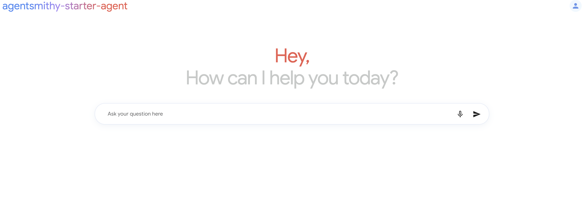

# AgentSmithy Frontend

This project was generated with [Angular CLI](https://github.com/angular/angular-cli) version 15.1.3.

<p align="left">
    
</p>

## Development server

Run `ng serve` for a dev server. Navigate to `http://localhost:4200/`. The application will automatically reload if you change any of the source files.

## Code scaffolding

Run `ng generate component component-name` to generate a new component. You can also use `ng generate directive|pipe|service|class|guard|interface|enum|module`.

## Build

Run `ng build` to build the project. The build artifacts will be stored in the `dist/` directory.

## Running unit tests

Run `ng test` to execute the unit tests via [Karma](https://karma-runner.github.io).

## Running end-to-end tests

Run `ng e2e` to execute the end-to-end tests via a platform of your choice. To use this command, you need to first add a package that implements end-to-end testing capabilities.

## Deploying to Cloud Run using Cloud Build
**Run Cloud Build Job**

   - The file [`deployment/cd/dev.yaml`](cd/dev.yaml) contains a Cloud Build Manifest that will build and push your agent frontend container and deploy it to Cloud Run. There are a couple of substitution variables to be set when using this file. 

   | Variable                               | Description                                                                           | Required |
   | ---------------------------------------| ------------------------------------------------------------------------------------- | :------: |
   | _CONTAINER_NAME                        | The name of the backend container. Defaults to "chatbot_ui"                           |   No     |
   | _PROJECT_ID                            | Google Cloud Project ID for resource deployment.                                      |   Yes    |
   | _ARTIFACT_REGISTRY_REPO_NAME           | Artifact registry for containers.                                                     |   Yes    |
   | _SERVICE_NAME                          | The name of the backend Cloud Run service. Defaults to "chatbot-ui-service"           |   No     |
   | _REGION                                | The region to use for the container and Cloud Run service. Defaults to "us-central1"  |   No     |

   - Example run:
   `gcloud builds submit --config deployment/cd/dev.yaml --substitutions _CONTAINER_NAME=chatbot_ui,_PROJECT_ID=next-2024-industry-demos,_ARTIFACT_REGISTRY_REPO_NAME=my_artifact_registry,_SERVICE_NAME=chatbot-ui-service,_REGION=us-central1 .`

   - The file [`src/environments/environment.ts`](src/environments/environment.ts) contains information related to your backend runtime deployment. Update this file with your deployment details:

   ```typescript
    const env: string = 'dev';

    let backendURL: string;
    let chatbotName: string;

    switch (env) {
    case 'prod':
        backendURL = "https://your-production-backend.com/"; // Replace with your production URL
        chatbotName = "your-production-chatbot-name"; // Replace with your production chatbot name
        break;
    case 'stage':
        backendURL = "https://your-staging-backend.com/"; // Replace with your staging URL
        chatbotName = "your-staging-chatbot-name"; // Replace with your staging chatbot name
        break;
    case 'dev':
    default:
        backendURL = "http://localhost:8000/";
        chatbotName = "agentsmithy-starter-agent";
        break;
    }

    export const environment = {
    production: env === 'prod',
    backendURL: backendURL,
    chatbotName: chatbotName,
    environmentName: env, 
    };
   ```
 

## Further help

To get more help on the Angular CLI use `ng help` or go check out the [Angular CLI Overview and Command Reference](https://angular.io/cli) page.
