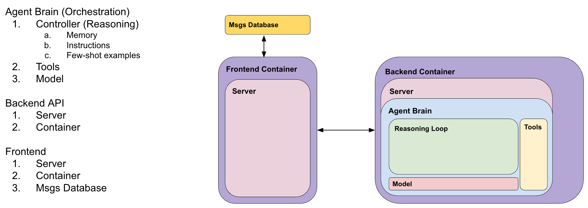

# AgentSmithy

AgentSmithy provides a series of tools and templates that **simplify the process of building and deploying custom AI agents on Google Cloud**. These templates provide users with a customizable, end-to-end codebase for building, deploying, and operating agents. Users can customize this codebase directly and are provided with a number of preset options for selecting their preferred *orchestration framework*, *foundation model(s)*, *runtime environment*, *tools*, and *industry*. 

AgentSmithy provides both a backend server for controlling the agent and a frontend for interacting with the agent. AgentSmithy also comes complete with a set of performant tools, including a deployable Retrieval Augmented Generation (RAG) tool built upon Vertex AI Search (now part of Agent Builder). 

To summarize, we have vastly simplified the process of building and deploying agents on GCP and have provided you this codebase to accelerate your agents journey.

# Configurable Options

Below is a list of the options that AgentSmithy currently supports:

**AGENT ORCHESTRATION FRAMEWORKS:**
- LangChain
- LangGraph
- LlamaIndex
- Vertex AI Agent Framework (coming soon)

**AGENT FOUNDATION MODELS:**
- Gemini 2.0 Pro (Experiment v02-05)
- Gemini 2.0 Flash
- Gemini 1.5 Pro
- Gemini 1.5 Flash
- Claude 3.7 Sonnet
- Claude 3.5 Sonnet v2
- Llama 3.3 70b-instruct-maas
- Llama 3.1 405b-instruct-maas

**AGENT RUNTIME ENVIRONMENTS:**
- Cloud Run / Fast API
- Vertex AI Agent Engine

**AGENT TOOLS:**
- RAG using Vertex AI Search
- OOTB LangChain tools, including YahooFinanceNewsTool and PubmedQueryRun

**AGENT INDUSTRY TYPE:**
- finance
- healthcare
- retail

# Install & Setup

## Prerequisites:

1. A Google Cloud project.
2. Python3.10 or greater installed on your machine.
3. Terraform installed on your machine.
4. The account running the terraform must have the necessary permissions. Recommended roles listed below:
```
- roles/serviceusage.serviceUsageAdmin
- roles/resourcemanager.projectIamAdmin
- roles/iam.serviceAccountAdmin
- roles/iam.serviceAccountUser
- roles/storage.admin
- roles/artifactregistry.admin
- roles/run.admin
- roles/cloudbuild.builds.editor
```

## Install:

   - First, open a terminal and enable required Google Cloud APIs:

   ```bash
   gcloud config set project $YOUR_DEV_PROJECT
   gcloud services enable serviceusage.googleapis.com cloudresourcemanager.googleapis.com
   ```

   - Then, create a python virtual environment and activate the venv:

   ```bash
   python -m venv agentsmith-venv
   source agentsmith-venv/bin/activate
   ```

   - Install the required packages:

   ```bash
   pip install poetry
   poetry install --directory Runtime_env/
   ```

   - Set the required variables in [Runtime_env/deployment/config/dev.yaml](Runtime_env/deployment/config/dev.yaml). Check [this section](#environment-variables) for a list of supported values. Example configuration shown below:

   ```yaml
   PROJECT_ID: next-2025-industry-demos
   VERTEX_AI_LOCATION: us-central1
   AGENT_BUILDER_LOCATION: us
   AGENT_INDUSTRY_TYPE: finance
   AGENT_ORCHESTRATION_FRAMEWORK: langgraph_prebuilt_agent
   AGENT_FOUNDATION_MODEL: gemini-2.0-flash
   USER_AGENT: agentsmithy-starter-agent
   AGENT_DESCRIPTION: "This is a test agent"
   ```

   - If you would like to use Agent Engine, update the [build.py](build.py) script and change:
   
   `DEPLOY_TO_AGENT_ENGINE = True`

   - Run the build script:

   ```bash
   python build.py
   ```

   - Type 'yes' when prompted to confirm

This will deploy Cloud Run services for the frontend and backend according to your selected configuration.

## Authentication
These Cloud Run services will be deployed by default with the configuration `Allow unauthenticated invocations`. Update the code templates to incorporate your own custom authentication. The easiest options include deploying [Identity-Aware Proxy (IAP)](https://cloud.google.com/iap/docs/enabling-cloud-run) or using [Firebase Authentication](https://cloud.google.com/run/docs/authenticating/end-users) to manage user credentials and authentication flow. 

# Environment Variables:
AgentSmithy uses env vars defined in [Runtime_env/deployment/config/dev.yaml](Runtime_env/deployment/config/dev.yaml) to determine the specific configuration of the Agents. Supported values for these env vars are listed below:

**PROJECT_ID:**
- Any valid GCP project

**VERTEX_AI_LOCATION:**
- Any GCP location

**AGENT_BUILDER_LOCATION:**
- "us"
- "global"

**AGENT_INDUSTRY_TYPE:**
- "finance"
- "healthcare"
- "retail"

**AGENT_ORCHESTRATION_FRAMEWORK:**
- "langchain_prebuilt_agent"
- "langchain_vertex_ai_agent_engine_agent"    # use if using Agent Engine deployment e.g. `DEPLOY_TO_AGENT_ENGINE = True` in build.py
- "langgraph_prebuilt_agent"
- "langgraph_vertex_ai_agent_engine_agent"    # use if using Agent Engine deployment e.g. `DEPLOY_TO_AGENT_ENGINE = True` in build.py
- "llamaindex_agent"                          # can use with either Agent Engine or Cloud Run deployment

**AGENT_FOUNDATION_MODEL:**
- "gemini-2.0-pro-exp-02-05"
- "gemini-2.0-flash"
- "gemini-1.5-pro"
- "gemini-1.5-flash"
- "claude-3-7-sonnet"             # requires permission / signing T&C
- "claude-3-5-sonnet-v2"          # requires permission / signing T&C
- "llama-3.3-70b-instruct-maas"   # requires the model to be enabled
- "llama-3.1-405b-instruct-maas"  # requires the model to be enabled

**USER_AGENT:**
- Any short name for your agent; do not include numbers or special characters

**AGENT_DESCRIPTION:**
- Any short description for your agent; place within quotes.


# Further Reading:

A functional agent consists of 3 main components and several subcomponents: 
1. Agent Orchestration
2. Backend API Server
3. Frontend App Server

<p align="left">
    
</p>

There is a vast numbers of options to choose from for each of these components and subcomponents. AgentSmithy provides a list of some of the more popular frameworks and tools used for these components.

## Other Documentation

Specifics on each of these components can found in their respective READMEs:
1. [Frontend README.md](ChatbotUI/README.md)
2. [Backend README.md](Runtime_env/README.md)
3. [Infrastructure README.md](Runtime_env/deployment/README.md)


## Tools, Use Cases, & Sample Prompts

Tools are external functions, services, or resources that an agent can use to interact with the outside world and extend its capabilities. They allow an agent to go beyond its pre-programmed knowledge and perform actions.
Based on your selection of finance, your agent has been configured with the following use case and tools:


### **Industry: Finance**

Use Case: **AI-Powered Investment Research Analyst for Alphabet:** Provides financial insights on Alphabet by analyzing its financial reports, strategic initiatives, and management perspectives from its historical investor documents. (Disclaimer: This Agent is for demonstration purposes only)

Available Tool(s):

retrieve_info: This tool uses Vertex AI Search to perform Retrieval Augmented Generation (RAG) on a given dataset. This agent has access to the following dataset:

`Alphabet Investor PDFs`: This dataset contains PDFs of quarterly earnings releases and annual reports for Alphabet for every quarter since 2004. The Annual reports include  financial statements (balance sheet, income statement, cash flow statement), a letter to shareholders, management discussion and analysis (MD&A), and information on corporate governance. The quarterly earnings releases also contain key financial statements like the income statement, balance sheet, and cash flow statement, along with management commentary and analysis of quarterly performance.

Sample Prompts:

1. How did Alphabet perform in their earnings reports in Q4 2024?
2. What were Alphabet’s key strategic priorities for the 2024?
3. How does each Alphabet business segment contribute to overall revenue and profit?


### **Industry: Healthcare**

Use Case: **Symptom Checker and Triage Assistant:** Analyzes general medical symptoms and acts as a virtual assistant to help triage patients to the appropriate level of care during consultations. (Disclaimer: This Agent is for demonstration purposes only and is NOT a substitute for professional medical advice)

Available Tool(s):

medical_publications_tool: Utilizes the PubMed API to pull data from the PubMed database, which is a free, searchable database developed and maintained by the National Center for Biotechnology Information (NCBI) and provides access to citations and abstracts of biomedical literature.

retrieve_info: This tool uses Vertex AI Search to perform Retrieval Augmented Generation (RAG) on a given dataset. This agent has access to the following dataset:

`PriMock57 Healthcare consultations`: This dataset consists of 57 mock medical primary care consultations held over 5 days by 7 clinicians and 57 fake patients, using case cards that present complaints, symptoms, medical & general history etc.

Sample Prompts:

1. What could be causing lower back pain that radiates down my leg?
2. What red flag symptoms would indicate that my sore throat is something more serious than a cold?
3. Based on past consultations, are there specific symptoms that were particularly helpful in narrowing down a differential diagnosis?

### **Industry: Retail**

Use Case: **Google Product Discovery Assistant:** Answers product-specific questions on Google Products available on the Google Store (Disclaimer: This Agent is for demonstration purposes only)

Available Tool(s):

retrieve_info: This tool uses Vertex AI Search to perform Retrieval Augmented Generation (RAG) on a given dataset. This agent has access to the following dataset:

`Google Store`: This data is a list of html web pages from the Google Store from
2023. It represents a listing of products, details, prices, etc related to
Google products.


Sample Prompts:

1. What are the specs for the Pixel 6 camera?
2. What is the water resistance rating of the Pixel?
3. What kind of screen does the Google Nest Hub have?


## How to Select Options:
Tradeoffs for each of the options provided by AgentSmithy are listed below:

### Runtime Environment:
With AgentSmithy, there are two primary options available to you: Cloud Run / Fast API and Vertex AI Agent Engine. Agent Engine is a fully managed runtime offering which simplifies the process of deploying agents. The Cloud Run / Fast API option is more bespoke and will allow you to get under the hood and customize the server configurations, API setup, request and response structure, etc.

1. **Cloud Run / Fast API:** Vertex AI Agent Engine (formerly known as LangChain on Vertex AI or Vertex AI Reasoning Engine) is a fully managed Google Cloud service enabling developers to deploy, manage, and scale AI agents in production. Agent Engine handles the infrastructure to scale agents in production so you can focus on creating intelligent and impactful applications. Vertex AI Agent Engine offers:
    - **Fully managed:** Deploy and scale agents with a managed runtime that provides robust security features including VPC-SC compliance and comprehensive end-to-end management capabilities. Gain CRUD access to multi-agent applications that use Google Cloud Trace (supporting OpenTelemetry) for performance monitoring and tracing. To learn more, see deploy an agent.
    - **Quality and evaluation:** Ensure agent quality with the integrated Gen AI Evaluation service.
    - **Simplified development:** Agent Engine abstracts away low-level tasks such as application server development and configuration of authentication and IAM, allowing you to focus on the unique capabilities of your agent, such as its behavior, tools, and model parameters. Furthermore, your agents can use any of the models and tools, such as function calling, in Vertex AI.
    - **Framework agnostic:** Enjoy flexibility when deploying agents that you build using different python frameworks including LangGraph, Langchain, AG2, and CrewAI. If you already have an existing agent, you can adapt it to run on Agent Engine using the custom template in our SDK. Otherwise, you can develop an agent from scratch using one of the framework-specific templates we provide.

2. **Vertex AI Agent Engine:** Cloud Run provides a scalable environment to host AI agents. AI agents can be implemented as Cloud Run services and perform tasks and provide information to users in a conversational manner. Cloud Run provides automatic scaling and high scalability without provisioning resources, while only billing for actual usage.

    You can use a Cloud Run service as a scalable API endpoint to process prompts from end users. Cloud Run offers several benefits when hosting AI agents:
    - **Scalability and Cost Efficiency:** Cloud Run automatically scales the number of container instances based on the incoming traffic, ensuring that your AI agent can handle varying workloads without performance degradation. The pay-per-use pricing model means you only pay for the resources consumed during request processing, optimizing costs during periods of low activity. This eliminates the need for pre-provisioning resources, reducing operational overhead.
    - **Integration with Google Cloud Ecosystem:** Seamlessly integrate your AI agents deployed on Cloud Run with other Google Cloud services like Vertex AI, BigQuery, and Cloud Storage. You can easily access pre-trained models, store data, and perform data analysis within your agent workflows. Cloud Run provides built-in support for authentication and authorization using Identity and Access Management (IAM), ensuring secure access to your resources.
    - **Customization and Flexibility:** Cloud Run supports any programming language or framework packaged in a container. This allows you to use your preferred tools and libraries for developing AI agents. You can customize the container environment to meet the specific dependencies and requirements of your agent, ensuring a consistent and reliable execution environment. You have direct control over the container image, allowing for fine-grained control over the deployment environment.
    - **Simplified Deployment:** Deploying an AI agent to Cloud Run is straightforward and can be done through the Google Cloud Console, Cloud Shell, or programmatically using the Cloud SDK. Cloud Run handles the underlying infrastructure management, simplifying the deployment process and reducing the operational burden. This allows developers to focus on building and improving their AI agents, rather than managing infrastructure.


### Orchestration Framework:
AI Agent Orchestration Frameworks have control loops that intelligently route user queries or tasks to the most appropriate agents or tools based on their capabilities and context. They also maintain awareness of the current context and history of interactions, ensuring that agents have the necessary information to perform their tasks effectively.

1. **LangChain:** LangChain is a framework designed to help developers build LLM-powered applications. It provides tools, components, and interfaces to simplify the process of creating complex LLM-based applications. Think of it as a toolbox filled with everything you might need for a wide range of LLM projects.

    **Key Details:**

    - **Flexibility vs. Complexity:**
        - **Benefit:** LangChain is incredibly flexible. You can customize almost every aspect of your LLM application, from the prompt templates to the model selection to the memory management. This makes it suitable for very specialized use cases.
        - **Tradeoff:** This flexibility comes at the cost of increased complexity. You need to understand the individual components and how they interact, which can be a steep learning curve for beginners. Requires more manual configuration.
    - **Broad Applicability vs. Depth:**
        - **Benefit:** LangChain supports a vast array of LLMs, vector stores, and integrations with other tools and services. It is designed to handle a broad range of application types.
        - **Tradeoff:** Because it tries to be everything to everyone, it may not always offer the most optimized solution for a specific task. Other frameworks may have deeper optimizations for certain domains.
    - **Active Community & Ecosystem vs. API Stability:**
        - **Benefit:** LangChain boasts a very active community and a rapidly evolving ecosystem. This means you'll find plenty of support, examples, and new tools being developed.
        - **Tradeoff:** The rapid development also means the API can change frequently. You might need to adapt your code as LangChain evolves (although efforts are being made to stabilize APIs).

2. **LangGraph:** LangGraph, built on top of LangChain, is specifically designed for building stateful, multi-actor applications. It allows you to define a graph-like structure where nodes represent different "actors" (e.g., an LLM, a tool, a human reviewer), and edges define the flow of information between them. Think of it as a system designed to make it easier to manage complex, multi-step LLM workflows.

    **Key Details:**

    - **Structured Workflow vs. Design Overhead:**
        - **Benefit:** LangGraph enforces a structured workflow using a graph representation. This makes it easier to reason about the application's logic, manage state, and handle complex interactions.
        - **Tradeoff:** Requires a more upfront investment in designing the graph structure. Simple sequential workflows might be overkill for LangGraph, as the initial design overhead can be high.
    - **State Management vs. Simplicity:**
        - **Benefit:** LangGraph excels at state management. It provides built-in mechanisms for tracking the application's state as it moves through the graph, which is crucial for multi-step processes and agents.
        - **Tradeoff:** The state management features add complexity to the code. If your application doesn't require persistent state or complex back-and-forth interactions, LangGraph might be unnecessarily complex.
    - **Multi-Actor Focus vs. Limited Task Applicability:**
        - **Benefit:** LangGraph is explicitly designed for applications with multiple actors and decision points. This makes it ideal for building sophisticated agents, complex dialogue systems, and automated workflows.
        - **Tradeoff:** Not well-suited for simple tasks such as running a single prompt through a model to perform text summarization.

3. **LlamaIndex:** LlamaIndex is focused on data indexing and retrieval specifically for LLMs. It provides tools to connect LLMs to your private or domain-specific data. It helps you prepare and structure your data so LLMs can easily access and reason over it. Think of it as a specialized tool for building LLM applications that need to access and understand your data.

    **Key Details:**

    - **Data-Centric Focus vs. General LLM Tooling:**
        - **Benefit:** LlamaIndex specializes in data indexing and retrieval. It offers optimized data structures, indexing algorithms, and query engines for LLMs to effectively use your data.
        - **Tradeoff:** LlamaIndex is less focused on the broader aspects of LLM application development, such as prompt engineering, agent building, or general purpose LLM orchestration. These aspects are handled more comprehensively by LangChain.
    - **Data Agnostic vs. Specific Vector DB Optimization:**
        - **Benefit:** Supports a wide range of data sources (PDFs, websites, databases, etc.) and vector stores (Pinecone, Weaviate, Chroma).
        - **Tradeoff:** While it connects to many vector DBs, it may not offer the deepest level of optimization for each individual vector store. You might need to fine-tune your vector store configuration for optimal performance.
    - **Abstraction vs. Customization:**
        - **Benefit:** LlamaIndex provides high-level abstractions for common data indexing and querying tasks. This simplifies the process of connecting LLMs to your data.
        - **Tradeoff:** The abstractions can limit customization in some cases. If you need very fine-grained control over the data indexing or querying process, you might need to dive deeper into the underlying libraries or build custom solutions.


### Foundation Model:
AI agents leverage foundation models, to process information, reason, and interact with their environment, enabling them to perform tasks autonomously. How they work:

- **Reasoning and Planning:** Foundation models can help AI agents reason about complex situations, plan actions, and make decisions based on their understanding of the environment. 
- **Action Execution:** AI agents can use foundation models to generate instructions or commands that control their actions. 
- **Tool Calling:** AI agents can leverage tool calling capabilities to access external tools and APIs to perform tasks that the foundation model alone cannot handle, such as accessing databases, performing calculations, or making web requests.

1. **Gemini 2.0 Flash:** A rapid and efficient model ideal for quick tasks and high-throughput applications where cost is a primary concern.

    - **Strengths:** Speed, Efficiency, Cost-effectiveness. Strong general knowledge.
    - **Best For:**
        - **Quick Queries and Fact Retrieval:** Answering simple questions, looking up information in a database, providing quick summaries.
        - **Real-time Interactions:** Tasks where low latency is crucial, such as chat support or immediate feedback.
        - **Lightweight Reasoning:** Simple logical deductions or pattern recognition.
        - **Tool Use for API Calls:** Acting as the "translator" to turn natural language into API requests for external tools.
    - **Example Scenario:** You're building a customer service chatbot that needs to provide quick answers to frequently asked questions. You need high throughput and low latency, and don't want to pay a fortune per request. The goal is to quickly resolve common issues and reduce the workload on human agents.

2. **Gemini 1.5 Pro:** A powerful model with a massive context window, enabling complex reasoning and analysis of large datasets.

    - **Strengths:** Huge Context Window (millions of tokens), Strong Reasoning, Multimodal Capabilities, Good General Knowledge.
    - **Best For:**
        - **Complex Reasoning and Analysis:** Analyzing large documents, identifying trends, drawing inferences from multiple sources.
        - **Long-Form Content Generation:** Writing articles, reports, scripts, or other lengthy outputs.
        - **Multimodal Understanding:** Processing and integrating information from text, images, audio, and video. (Assuming it supports this. Confirm with model documentation).
        - **Memory and State Maintenance:** Remembering past interactions and using that information to inform future responses.
    - **Example Scenario:** You're creating a research assistant that needs to analyze large volumes of documents (e.g., legal contracts, scientific papers, financial reports) to extract key insights, identify trends, and answer complex questions. The agent needs to maintain context across the entire document collection and perform sophisticated reasoning.

3. **Claude 3.7 Sonnet (Model Garden):** Anthropic's most intelligent model to date and the first Claude model to offer extended thinking—the ability to solve complex problems with careful, step-by-step reasoning. Claude 3.7 Sonnet balances speed and quality by choosing between standard thinking for near-instant responses or extended thinking for advanced reasoning.

    - **Strengths:** Strong natural language understanding, conversational capabilities, creative writing, excellent safety/alignment
    - **Best For:**
        - **Agentic coding:** State-of-the-art for agentic coding, and can complete tasks across the entire software development lifecycle—from initial planning to bug fixes, maintenance to large refactors.
        - **Customer-facing agents:** Powerful instruction following, tool selection, error correction, and advanced reasoning for customer-facing agents and complex AI workflows.
        - **Computer use:** Accurate for computer use, enabling developers to direct Claude to use computers the way people do.
        - **Content generation and analysis:** Excels at writing and is able to understand nuance and tone in content to generate more compelling content and analyze content on a deeper level.
    - **Example Scenario:** You're developing a writing assistant or a social media manager that needs to generate engaging and creative content (e.g., blog posts, marketing copy, social media updates). The agent needs to produce high-quality, human-like text that aligns with your brand voice.

4. **Claude 3.5 Sonnet v2 (Model Garden):** A state-of-the-art model for real-world software engineering tasks and agentic capabilities

    - **Strengths:** Strong natural language understanding, conversational capabilities, creative writing, excellent safety/alignment
    - **Best For:**
        - **Agentic tasks and tool use:** Offers powerful instruction following, tool selection, error correction, and advanced reasoning for agentic workflows that require tool use.
        - **Coding:** Offers strong performance in both planning and solving for complex coding tasks, including code migrations, code fixes, and translations.
        - **Document Q&A:** Combines strong context comprehension, advanced reasoning, and synthesis to deliver accurate and human-like responses.
        - **Content generation and analysis:** Can understand nuance and tone in content, generating compelling content and analyzing content on a deeper level.
    - **Example Scenario:** You are building a conversational AI system for customer support, or a general purpose chatbot and you need a response that balances creative abilities with the speed necessary for a fluid conversation.

5. **Llama 3.3 70B (Model Garden):** An open-source, customizable model with strong performance and broad applicability, enabling fine-tuning for specific tasks.

    - **Strengths:** Open Source, Customizable (fine-tunable), Strong Performance, Broad Applicability. A good balance between size and capability.
    - **Best For:**
        - **Tasks Requiring Customization:** Fine-tuning to specific domains or tasks.
        - **General-Purpose AI:** Suitable for a wide range of tasks, including question answering, text generation, and summarization.
        - **Resource-Constrained Applications:** Excellent choice for mobile, edge, and embedded devices where computational power and memory are limited.
        - **Rapid Prototyping and Experimentation:** Ideal for quickly testing AI concepts and developing proof-of-concepts due to its smaller size and faster training times.
    - **Example Scenario:** You have a specific domain or task where you want to optimize performance by fine-tuning a model on your own data. You also want control over the model's behavior and you're willing to invest the time and resources to fine-tune and maintain the model.

6. **Llama 3.3 70B (Model Garden):** A massive open-source model for tackling the most challenging problems, requiring deep understanding and complex reasoning capabilities.

    - **Strengths:** Huge Capacity, High Potential for Complex Reasoning, Strong General Knowledge, Open Source, Customizable (fine-tunable)
    - **Best For:**
        - **Highly Complex Tasks:** Requires extensive reasoning and knowledge.
        - **Cutting-Edge Research:** Exploring the limits of AI capabilities.
        - **Creating Highly Specialized Agents:** Requiring a deep understanding of a particular domain.
    - **Example Scenario:** You're tackling a highly challenging problem that requires deep understanding and complex reasoning. You have a large dataset to work with and you're willing to invest in a larger model. This is a research project or a task where maximizing accuracy and sophistication is paramount, even if it means higher cost and latency.


# Contributors

[Sean Rastatter](mailto:srastatter@google.com): Eng TL

[Ivan Rufino](mailto:ivanerufino@google.com): Eng

[Arpit Vaidya](mailto:arpit@google.com): GTM

[Dinesh Varyani](mailto:dineshvaryani@google.com): Eng (UX)

[Rob Keohane](mailto:rkeohane@google.com): Eng (UX)

[Robin Singh](mailto:robbysingh@google.com): Eng (UX)

[Kar-Fai Tse](mailto:ktse@google.com): Eng (DevOps)

[Matt Geneau](mailto:mgeneau@google.com): Eng (DevOps)

[Stuart Ramgolam-Singh](mailto:sramgolamsingh@google.com): Eng (DevOps)

# Acknowledgements

AgentSmithy utilized two open source projects to speed up development. We found these resources invaluable and appreciate the teams that built and maintain them. 

1. [Agent Starter Pack](https://github.com/GoogleCloudPlatform/agent-starter-pack)
2. QuickBot

# Contributing

Contributions are welcome! See the [Contributing Guide](CONTRIBUTING.md).

# Feedback

We value your input! Your feedback helps us improve AgentSmithy and make it more useful for the community.

## Getting Help

If you encounter any issues or have specific suggestions, please first consider [raising an issue](https://github.com/GoogleCloudPlatform/AgentSmithy/issues) on our GitHub repository.

## Share Your Experience

For other types of feedback, or if you'd like to share a positive experience or success story using this starter pack, we'd love to hear from you! You can reach out to us at <a href="mailto:agentsmithy-feedback@google.com">agentsmithy-feedback@google.com</a>.

Thank you for your contributions!

# Relevant Terms of Service

[Google Cloud Platform TOS](https://cloud.google.com/terms)

[Google Cloud Privacy Notice](https://cloud.google.com/terms/cloud-privacy-notice)


# Responsible Use

Building and deploying generative AI agents requires a commitment to responsible development practices. AgentSmithy provides the you the tools to build agents, but you must also provide the commitment to ethical and fair use of these agents. We encourage you to:

*   **Start with a Risk Assessment:** Before deploying your agent, identify potential risks related to bias, privacy, safety, and accuracy.
*   **Implement Monitoring and Evaluation:** Continuously monitor your agent's performance and gather user feedback.
*   **Iterate and Improve:**  Use monitoring data and user feedback to identify areas for improvement and update your agent's prompts and configuration.
*   **Stay Informed:**  The field of AI ethics is constantly evolving. Stay up-to-date on best practices and emerging guidelines.
*   **Document Your Process:**  Maintain detailed records of your development process, including data sources, models, configurations, and mitigation strategies.

# Disclaimer

**This is not an officially supported Google product.**

Copyright 2025 Google LLC. All Rights Reserved.

Licensed under the Apache License, Version 2.0 (the "License");
you may not use this file except in compliance with the License.
You may obtain a copy of the License at

http://www.apache.org/licenses/LICENSE-2.0

Unless required by applicable law or agreed to in writing, software
distributed under the License is distributed on an "AS IS" BASIS,
WITHOUT WARRANTIES OR CONDITIONS OF ANY KIND, either express or implied.
See the License for the specific language governing permissions and
limitations under the License.
