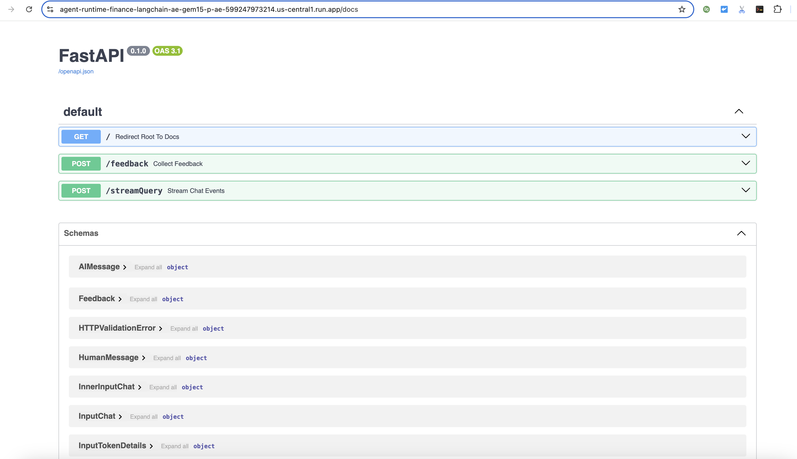

# AgentSmithy Runtime & Orchestration

This folder contains the primary backend code for AgentSmithy Agents. It supports a number of different options for foundation models, orchestration frameworks, runtime environments, and industries.

## Folder Structure

```plaintext
.
├── server.py           # Main FastAPI server
├── orchestration/      # Controller logic for the Agent
│   ├── agent.py        # Defines a series of AgentManagers
    ├── constants.py    # Contains model names and prompts
    ├── enums.py        # Lists allowed customizable options
    ├── server_utils.py # Utility files for setting up the agent
    ├── tools.py        # Defines agent tools
│   └── config.py       # Reads environment variables
├── utils/              # Utility functions and classes
└── rag/                # Functions for setting up RAG using Vertex Search
```

## Docs

The agent server comes with a Swagger API spec which can be found as the /docs route (e.g. `http://localhost:4200/docs`). A screenshot of this is shown below:

<p align="left">
    
</p>

## Setting Configuration Options

A complete list of configuration options is shown below. These can be set by editing [`deployment/config/dev.yaml`](../deployment/config/dev.yaml) with your Google settings. There are certain variables that must be set manually and some variables that will be auto-populated if you run `build.py`. These variables that must be set manually are marked below as required.

   | Variable                               | Description                                                          | Required |
   | ---------------------------------------| -------------------------------------------------------------------- | :------: |
   | PROJECT_ID                             | Google Cloud Project ID for resource deployment.                     |   Yes    |
   | VERTEX_AI_LOCATION                     | The region to use for the various resources.                         |   Yes    |
   | AGENT_BUILDER_LOCATION                 | The region to use for Agent Builder (options shown below).           |   Yes    |
   | AGENT_INDUSTRY_TYPE                    | The selected industry type (options shown below).                    |   Yes    |
   | AGENT_ORCHESTRATION_FRAMEWORK          | The selected agent framework (options shown below).                  |   Yes    |
   | AGENT_FOUNDATION_MODEL                 | The selected foundation model (options shown below).                 |   Yes    |
   | USER_AGENT                             | The name of the agent.                                               |   Yes    |
   | AGENT_DESCRIPTION                      | The description of the agent.                                        |   Yes    |
   | FRONTEND_URL                           | The URL of frontend Cloud Run service. Used for CORS policy setting. |   No     |
   | GCS_STAGING_BUCKET                     | The name of the Staging bucket for Vertex AI resources.              |   No     |
   | DATA_STORE_ID                          | The ID of the Vertex AI Search Datastore                             |   No     |
   | GOOGLE_GENAI_USE_VERTEXAI              | Boolean value (set to "TRUE" if using ADK)                           |   No     |
   | GOOGLE_CLOUD_PROJECT                   | Google Cloud Project ID for resource deployment. (Used by ADK)       |   No     |
   | GOOGLE_CLOUD_LOCATION                  | The region to use for the various resources. (Used by ADK)           |   No     |

   - Options:

      AGENT_BUILDER_LOCATION:
      - "us"
      - "global"

      AGENT_INDUSTRY_TYPE:
      - "finance"
      - "healthcare"
      - "retail"

      AGENT_ORCHESTRATION_FRAMEWORK:
      - "langchain_prebuilt_agent"
      - "langchain_vertex_ai_agent_engine_agent" # use if using Agent Engine deployment
      - "langgraph_prebuilt_agent"
      - "langgraph_vertex_ai_agent_engine_agent" # use if using Agent Engine deployment
      - "llamaindex_agent"  # can use with either Agent Engine or Cloud Run deployment
      - "agent_development_kit_agent"  # can use with either Agent Engine or Cloud Run deployment"

      AGENT_FOUNDATION_MODEL:
      - "gemini-2.5-pro"
      - "gemini-2.5-flash"
      - "gemini-2.5-flash-lite"
      - "gemini-2.0-pro"
      - "gemini-2.0-flash"
      - "gemini-1.5-pro"
      - "gemini-1.5-flash"
      - "claude-3-7-sonnet" # requires permission / signing T&C; must be us-east5
      - "claude-3-5-sonnet-v2" # requires permission / signing T&C; must be us-east5
      - "llama-4-maverick-17b-128e-instruct-maas" # requires the model to be enabled
      - "llama-4-scout-17b-16e-instruct-maas" # requires the model to be enabled
      - "llama-3.3-70b-instruct-maas" # requires the model to be enabled
      - "llama-3.1-405b-instruct-maas" # requires the model to be enabled

   - Example Configuration:
   ```python
   PROJECT_ID: next-2024-industry-demos
   VERTEX_AI_LOCATION: us-central1
   AGENT_BUILDER_LOCATION: us
   AGENT_INDUSTRY_TYPE: finance
   AGENT_ORCHESTRATION_FRAMEWORK: langgraph_prebuilt_agent
   AGENT_FOUNDATION_MODEL: gemini-2.0-flash
   USER_AGENT: agentsmithy-starter-agent
   AGENT_DESCRIPTION: "This is a test agent"
   ```

   - If you want your agent runtime to use an Agent Engine deployment, specify this using the `AGENT_ENGINE_RESOURCE_ID` variable shown below. Do not define this variable if you do not want to use Agent Engine. Example:
   `AGENT_ENGINE_RESOURCE_ID: projects/599247973214/locations/us-central1/reasoningEngines/5008011581729013760`

   - If you want to use Agent Development Kit as your orchestration framework, specify this using the `GOOGLE_GENAI_USE_VERTEXAI`, `GOOGLE_CLOUD_PROJECT`, `GOOGLE_CLOUD_LOCATION` variables shown below. Example:

    GOOGLE_GENAI_USE_VERTEXAI: 'TRUE'
    GOOGLE_CLOUD_PROJECT: next-2024-industry-demos
    GOOGLE_CLOUD_LOCATION: us-central1


These environment variables are read in when you run `server.py`. Thus, if you want to make a change to the configuration, you must either re-run `server.py` or you must re-import these modules at runtime.


## Deployments

`server.py` implements a Fast API server with your specific configuration / selection as defined above. For specifics on building and deploying the container for this server, see the [Deployment README.md](../deployment/README.md).

If you wish to additional deploy using Agent Engine, there is a utility function provided within [utils/utils.py](utils/utils.py) called `deploy_agent_to_agent_engine` which allows you to deploy a locally defined agent to Agent Engine. To use this function, you must provide your locally defined agent, as well as the name of the agent and it's description. The agent itself will be an instance of an Agent Executor in the case of `langchain_vertex_ai_agent_engine_agent` and `langgraph_vertex_ai_agent_engine_agent`, as these are off the shelf agents that Vertex AI Agent Engine provides and manages. In the case of `llamaindex_agent`, we have implemented a custom class to deploy to Agent Engine, so an instance of the custom class itself will be required. An example of this is shown below. In order for your deployed Agent Engine agent to be able to use the Vertex AI Search Index, the Agent Engine service account must be updated to include `roles/discoveryengine.editor`.

```python
from app.orchestration.server_utils import get_agent_from_config
from app.utils.utils import deploy_agent_to_agent_engine
from app.utils.utils import deploy_agent_to_agent_engine
from app.orchestration.config import (
    AGENT_INDUSTRY_TYPE,
    AGENT_ORCHESTRATION_FRAMEWORK,
    AGENT_FOUNDATION_MODEL,
    PROJECT_ID,
    VERTEX_AI_LOCATION,
    GCS_STAGING_BUCKET,
    USER_AGENT,
    AGENT_DESCRIPTION
)

vertexai.init(
    project=PROJECT_ID,
    location=VERTEX_AI_LOCATION,
    staging_bucket=GCS_STAGING_BUCKET
)

def run_agent_engine_deployment() -> str:
    agent_manager = get_agent_from_config(
        agent_orchestration_framework=AGENT_ORCHESTRATION_FRAMEWORK,
        agent_foundation_model=AGENT_FOUNDATION_MODEL,
        industry_type=AGENT_INDUSTRY_TYPE
    )

    remote_agent = None
    if AGENT_ORCHESTRATION_FRAMEWORK == "llamaindex_agent":
        remote_agent = deploy_agent_to_agent_engine(
            agent_manager,
            AGENT_NAME,
            AGENT_DESCRIPTION
        )

    elif AGENT_ORCHESTRATION_FRAMEWORK == "langgraph_vertex_ai_agent_engine_agent" or AGENT_ORCHESTRATION_FRAMEWORK == "langchain_vertex_ai_agent_engine_agent":
        remote_agent = deploy_agent_to_agent_engine(
            agent_manager.agent_executor,
            AGENT_NAME,
            AGENT_DESCRIPTION
        )

    if not remote_agent.resource_name:
        raise Exception("Error deploying Agent to Agent Engine.")

    try:
        # If AGENT_ENGINE_RESOURCE_ID is set, then the agent will query the remote agent
        with open("deployment/config/dev.yaml", "a") as f:
            f.write(f"\nAGENT_ENGINE_RESOURCE_ID: {remote_agent.resource_name}\n")
        f.close()
    except FileNotFoundError:
        print("`deployment/config/dev.yaml` file not found.")

    navigate_to_directory(".")

    # Retrieve the project number associated with your project ID
    project_number = subprocess.run(
        ["gcloud", "projects", "describe", PROJECT_ID, '--format=value(projectNumber)'],
        check=True,
        capture_output=True,
        text=True
    ).stdout.strip()

    # Add Discovery Engine Editor to the Agent Engine Service account
    iam_command = [
        "gcloud",
        "projects",
        "add-iam-policy-binding",
        PROJECT_ID,
        f"--member=serviceAccount:service-{project_number}@gcp-sa-aiplatform-re.iam.gserviceaccount.com",
        "--role=roles/discoveryengine.editor",
        "--no-user-output-enabled"
    ]
    subprocess.run(iam_command, check=True)

    return remote_agent.resource_name
```

## RAG with Vertex AI Agent Builder Search

Each agent has been preconfigured to have a RAG (Retrieval-Augmented Generation) tool using Vertex AI Agent Builder Search for the retrieval of information.

## Trace and Log Capture

This application utilizes [OpenTelemetry](https://opentelemetry.io/) and [OpenLLMetry](https://github.com/traceloop/openllmetry) for comprehensive observability, emitting events to Google Cloud Trace and Google Cloud Logging. Every interaction with LangChain and VertexAI is instrumented (see [`server.py`](server.py)), enabling detailed tracing of request flows throughout the application.

Leveraging the [CloudTraceSpanExporter](https://cloud.google.com/python/docs/reference/spanner/latest/opentelemetry-tracing), the application captures and exports tracing data. To address the limitations of Cloud Trace ([256-byte attribute value limit](https://cloud.google.com/trace/docs/quotas#limits_on_spans)) and [Cloud Logging](https://cloud.google.com/logging/quotas) ([256KB log entry size](https://cloud.google.com/logging/quotas)), a custom extension of the CloudTraceSpanExporter is implemented in [`utils/tracing.py`](utils/tracing.py).

This extension enhances observability by:

- Creating a corresponding Google Cloud Logging entry for every captured event.
- Automatically storing event data in Google Cloud Storage when the payload exceeds 256KB.

Logged payloads are associated with the original trace, ensuring seamless access from the Cloud Trace console.
